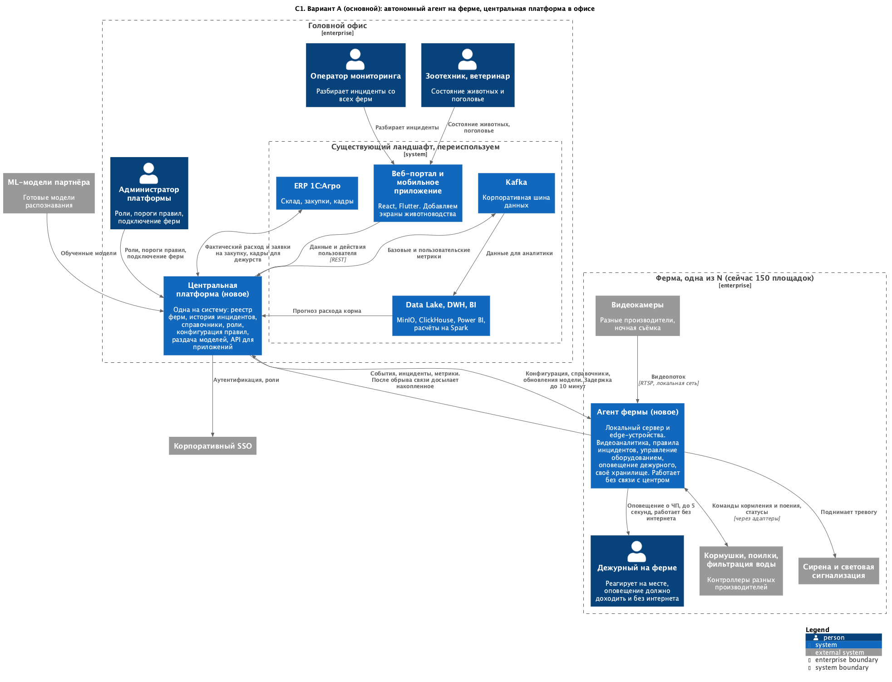
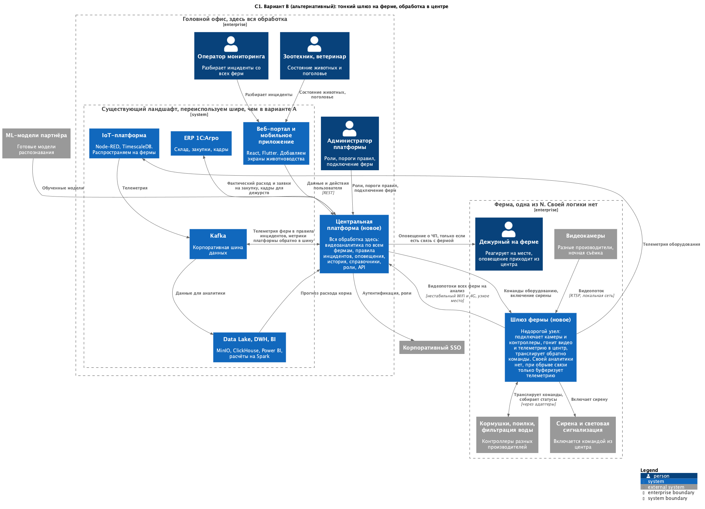

### **Название задачи: Контекст MVP платформы мониторинга скота «АгроТех Х»**
### **Автор: Никита Соловьёв**
### **Дата: 21.09.2026**

### **Проблема**
Автоматизация животноводства. Отлавливать ЧП с животными, управлять кормушками и поилками, считать
поголовье, следить за водой и запасами корма. Готовые продукты не подходят по законодательству и по цене,
поэтому делаем свой MVP.

Основные сложности в условиях. На фермах нестабильный wi-fi, от проишествия до оповещения есть 5 секунд, и
система должна работать, в том числе и без интернета. У компании уже есть Kafka, Data Lake, DWH, BI, ERP 1С:Агро,
веб-портал с мобильным приложением и IoT-платформа. Надо понять, что из этого можно переиспользовать, а что разрабатывать.

Состав сервисов и технологии интеграций здесь не выбираю, это уровень контейнеров.

### **Функциональные требования**
В скобках номер требования из задания.

|**№**|**Действующие лица или системы**|**Use Case**|**Описание**|
| :-: | :- | :- | :- |
|1|Камеры, агент фермы, дежурный|ЧП с животными по видео (ФТ 1, 2)|Агент распознаёт драку или задавливание поросят, создаёт инцидент, дежурный получает оповещение за 5 секунд|
|2|Камеры, агент фермы, ветеринар|Оценка состояния животного (ФТ 4)|Агент оценивает внешний вид и поведение, болезнь или гибель фиксируются как инцидент с указанием загона|
|3|Камеры, агент фермы, зоотехник|Пересчёт поголовья (ФТ 6)|Агент считает животных по загонам и сверяет со справочником, расхождение сверх порога это инцидент|
|4|Агент фермы, кормушки и поилки|Кормление и поение (ФТ 3)|Агент отдаёт команды контроллерам через адаптеры, отказ оборудования становится инцидентом|
|5|Фильтрация воды, агент фермы, инженер|Контроль фильтрации воды (ФТ 5)|Агент опрашивает контроллер, выход показателей за пороги создаёт инцидент|
|6|Агент фермы, центр, DWH, ERP|Запасы корма и прогноз (ФТ 7)|Расход уходит в центр и дальше в DWH, прогноз считается там же и возвращается в ERP как заявка на закупку|
|7|Инженер, администратор, агент фермы|Новое оборудование (ФТ 8)|Устройство регистрируется в реестре фермы и подключается через адаптер своего протокола|
|8|Администратор, центр, агент фермы|Подключение новой фермы (ФТ 9)|Администратор заводит ферму в реестре, агент разворачивается на площадке и забирает конфигурацию и модель|
|9|Агент фермы, дежурный, центр|Работа без интернета (ФТ 12)|Агент продолжает анализ и оповещения, копит события и досылает после восстановления связи|
|10|Центр, Kafka, DWH, BI|Метрики (ФТ 10, 11)|Центр публикует метрики в шину, оттуда в DWH и BI. Своя метрика описывается в конфигурации, без правки кода|
|11|Пользователи, SSO, приложения, центр|Доступ и приложения (ФТ 13, 14)|Вход через корпоративный SSO, права ограничены ролью и списком ферм, приложения работают через API центра|

### **Нефункциональные требования**

|**№**|**Требование**|
| :-: | :- |
|1|Отказоустойчивость 99,95%. Отказ фермы или канала связи не влияет на остальные фермы и на центр|
|2|Расширяемость: новое правило, метрика или тип устройства добавляются без переделки существующего|
|3|От фиксации ЧП до оповещения не больше 5 секунд|
|4|Видеоаналитика работает в реальном времени, счёт на миллисекунды|
|5|Задержка синхронизации фермы с центром до 10 минут, не считая проблем со связью|
|6|Ферма работает при нестабильном WiFi и при полном отсутствии интернета|
|7|На ферме один локальный сервер и набор edge-устройств|
|8|Камеры и контроллеры разных производителей, съёмка ночью, часть камер с «рыбьим глазом»|
|9|Модель распознавания приходит от партнёра: применяем и обновляем, но не обучаем|
|10|Число агентов не ограничено, сейчас 150 площадок. Решение не должно закрывать путь к SaaS|

### **Решение**
[C1-main.puml](C1-main.puml)

Как решение, можем использовать автономных агентов на каждой отдельной ферме, которые выполняют всю логику внутри себя 
и отправляют на центральный сервер только отчёты о своём выполнении. Всё, что критично по времени работает локально в 
рамках фермы. Критичным считается: приём видео, распознавание, правила, управление оборудованием, оповещение дежурного, 
локальное хранилище. В центральный сервер уходят события и метрики, видео не уходит.

Переиспользуем:
Kafka как шину метрик, Data Lake с DWH и BI для истории и отчётности, аналитику компании для
прогноза расхода корма, ERP для склада и кадров, корпоративный SSO. Веб-портал и мобильное приложение
дорабатываем экранами животноводства.

Разрабатываем:
Агента фермы и центральную платформу. IoT-платформу на ферму не берём, она собирает телеметрию
в центр и не даёт ни автономности, ни реального времени. SCADA теплиц мимо, другой домен.

**Плюсы:**
- Тяжелая работа выполняется целиком внутри локальный сети, не требуется отправлять тяжеловесные данные по сети.
- В центр идут события вместо видео, поэтому задержка до 10 минут и догон после обрыва не мешают, выполняем НФТ 5.
- Агенты одинаковые, подключение фермы не требует проводить доработку центра. Выполняем ФТ 9 и НФТ 2.
- Отказ одной фермы локален и не валит всю систему целиком. А так же при недоступности центра ферма продолжает работать.
- Агент в рамках фермы настраивается отдельно и может закреплять за собой некую поддерживающую команду. Следить за одним конкретным агентом проще чем за централизованной системой с большим кол-вом агентов сразу.

**Минусы:**
- Сервер с видеоаналитикой на каждой площадке, на 150 ферм это заметные деньги
- Разрабатываем две стороны сразу: агента и центральную платформу

### **Альтернативы**
[C1-alternative.puml](C1-alternative.puml)

Ферма использует простой шлюз, а вся тяжелая логика обрабатывается в центре. 
Шлюз подключает камеры и контроллеры, отправляет видео и телеметрию по сети в центр, телеметрия идёт через существующую IoT-платформу и Kafka.

**Плюсы:**
- Более дешевое оборудование на фермах
- Обновления кода и модели в одном месте
- Переиспользуется существующая архитектура, в перспективе MVP выйдет быстрее
- Один контур эксплуатировать проще, чем парк распределённых узлов

**Минусы:**
- Без интернета ферма перестаёт распознавать ЧП и оповещать дежурного. Не выполняем ФТ 12
- Учитывая что фермы имеют нестабильный WiFi, то будем сложно гарантировать 5 секунд и realtime. Я бы считал это главным минусом.
- Расходы на каналы связи и нагрузка на центр растут вместе с числом ферм и камер
- Для SaaS пришлось бы заводить трафик чужих ферм во внутренний контур компании. Тратим вычислительные мощности на работу чужих ферм.

**Недостатки, ограничения, риски**

- Обновления кода, правил и моделей надо доставлять на 150 ферм по слабому каналу, а состояние агентов
  наблюдать удалённо.
- Данные в центре отстают от фермы, штатно до 10 минут, при обрыве дольше. Источник истины это агент.
- Точность распознавания ограничена: тени, ночь, похожие особи, рыбий глаз. Для MVP считаю, что ложное
  срабатывание допустимо, а пропуск ЧП нет.
