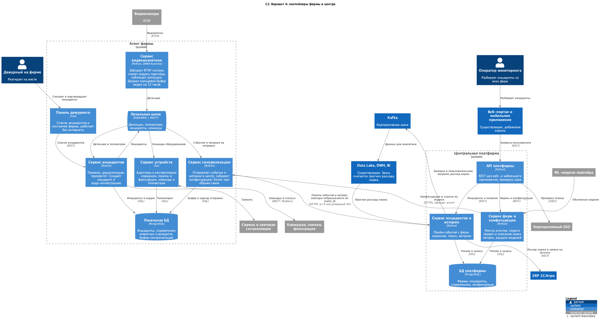
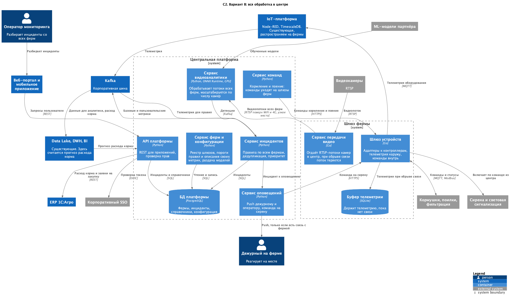

### **Название задачи: Ограниченные контексты, контейнеры и интеграции**
### **Автор: Никита Соловьёв**
### **Дата: 21.09.2026**

### **Функциональные требования**
Разложил функции по ограниченным контекстам.

|**№**|**Действующие лица или системы**|**Use Case**|**Описание**|
| :-: | :- | :- | :- |
|1|Видеоаналитика|Распознавание на видео (ФТ 1, 2, 4, 6)|Потоки с камер и модель партнёра. Наружу отдаёт только детекции|
|2|Инциденты|Правила и реакция (ФТ 1, 2, 4, 5)|Превращает детекции и телеметрию в инциденты по правилам. Отсюда уходит оповещение дежурному|
|3|Устройства|Оборудование фермы (ФТ 3, 5, 8)|Адаптеры к контроллерам разных производителей, команды и телеметрия|
|4|Поголовье и справочники|Животные, загоны, дежурства (ФТ 6, 7)|Справочник животных и загонов, график дежурств, сверка пересчёта. Кадры приходят из ERP|
|5|Синхронизация и конфигурация|Обмен ферма-центр (ФТ 9, 10, 11, 12)|Отправка событий и метрик, приём порогов и моделей, буфер и досылка накопленного после обрыва связи|
|6|Доступ|Роли и права (ФТ 13, 14)|Проверка токена в SSO, роли, ограничение доступа списком ферм. Живёт в центре|

Контексты 1-4 работают на ферме, 5 стоит по обе стороны канала, 6 только в центре.

### **Нефункциональные требования**

|**№**|**Требование**|
| :-: | :- |
|1|5 секунд от детекции до оповещения, видеоаналитика в реальном времени|
|2|Работа фермы без интернета, досылка накопленных данных после восстановления связи|
|3|Один сервер на ферму: память и диск ограничены, GPU один на все камеры|
|4|Расширяемость: новое правило или протокол устройства не ломают существующее|
|5|150 площадок, дальше SaaS: наружу не должно быть открыто лишнего|

### **Решение**
[C2-main.puml](C2-main.puml)

Контекст зафиксирован в [ADR-001](../Task1/ADR-001-context.md): агент на ферме и центральная платформа.

На ферме поднимаем пять сервисов: видеоаналитика, инциденты, устройства, синхронизация и панель дежурного. Под ними
локальная шина и PostgreSQL. В центре три сервиса и своя база.

Справочники животных отдельным сервисом не делаю, это две таблицы в локальной БД.

Видеоаналитику держу отдельно от инцидентов: она обновляется вместе с моделью партнёра, и обновление модели не должно
останавливать обработку инцидентов.

Интеграции:
- Внутри фермы обмен через RabbitMQ. Он умеет MQTT, на котором работают контроллеры, и нетребователен к ресурсам, а
сервер на ферме один. Выполняем НФТ 3.
- В центре Kafka, она уже есть у компании. Из неё читают DWH и BI.
- Ферма с центром обменивается пакетами по HTTPS. Выставлять Kafka наружу для 150 площадок, а потом ещё и для чужих
компаний, я бы не стал. Выполняем НФТ 5.
- Основной канал с центром wi-fi или провод, резервный через 4G-модем на сервере фермы. Если пропали оба, ферма работает
сама и досылает накопленное после восстановления связи. Выполняем НФТ 2.
- Пакет идёт с ключом event_id, повторы центр отбрасывает.
- Конфигурацию и модели агент забирает сам, доступ в сеть фермы снаружи не нужен.
- На ферме PostgreSQL. SQLite не подошёл, с базой работают несколько сервисов сразу.
- Видео в центр не уходит. На ферме кольцевой буфер на 12 часов, в инцидент попадает только кадр.

### **Альтернативы**
[C2-alternative.puml](C2-alternative.puml)

На ферме сервис передачи видео, шлюз устройств и буфер телеметрии на SQLite. Всё остальное в центре: видеоаналитика на GPU-узлах,
инциденты, команды оборудованию, оповещения. Телеметрия идёт через существующую IoT-платформу и Kafka.

**Плюсы:**
- Внутри центра всё общается через Kafka, которая уже есть. Ни пакетов, ни защиты от повторов
- На ферме нет ни брокера, ни базы, ни пяти процессов

**Минусы:**
- Видеопоток идёт по RTSP через нестабильный канал, и его надо как-то удерживать
- Команды оборудованию и включение сирены доставляются с центра на шлюз, то есть в ферму надо уметь достучаться снаружи

Разбиение на контексты в обоих вариантах одинаковое, отличается сторона канала, на которой живёт каждый контекст.

**Недостатки, ограничения, риски**

- Пять сервисов, брокер и база на одном сервере. Следить за этим удалённо сложнее, чем за одним бинарником.
- Вырастет число камер, с RabbitMQ придётся переезжать на Kafka, и это затронет все сервисы фермы.
- Если агент переустановят с потерей локальной БД, отбрасывание повторов по event_id не поможет. Этот сценарий не
прорабатывал.
- GPU на ферме один и делится между всеми камерами. Сколько камер он вытянет, надо измерить на пилоте.
