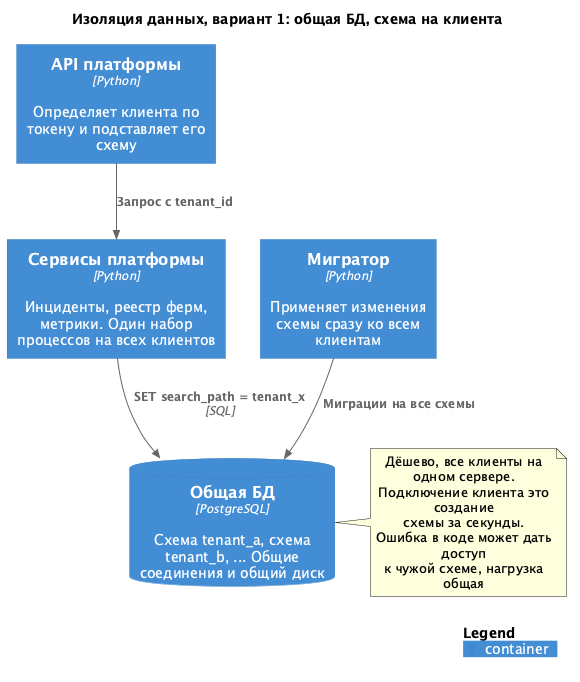
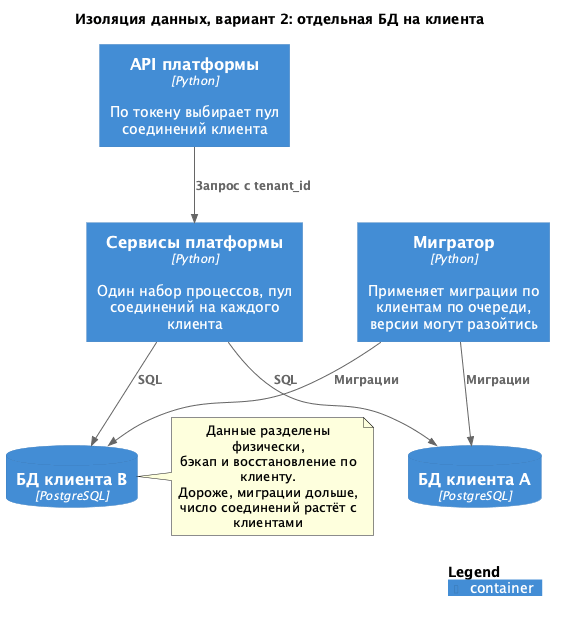
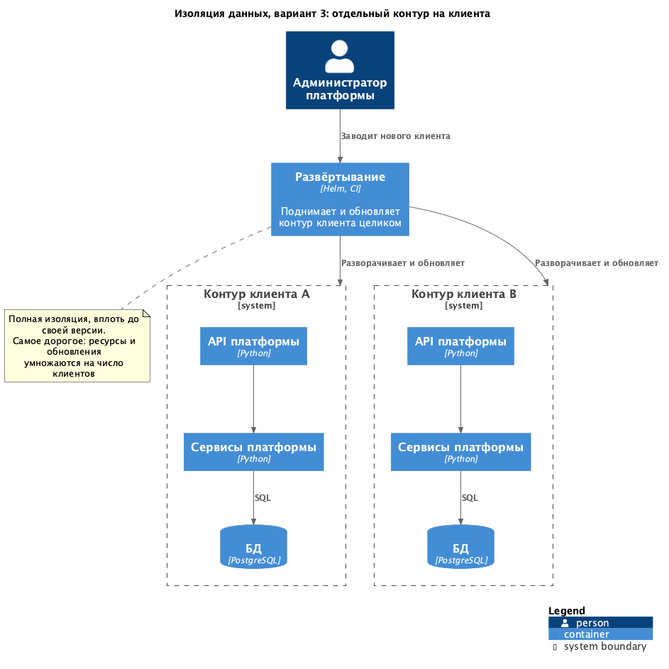
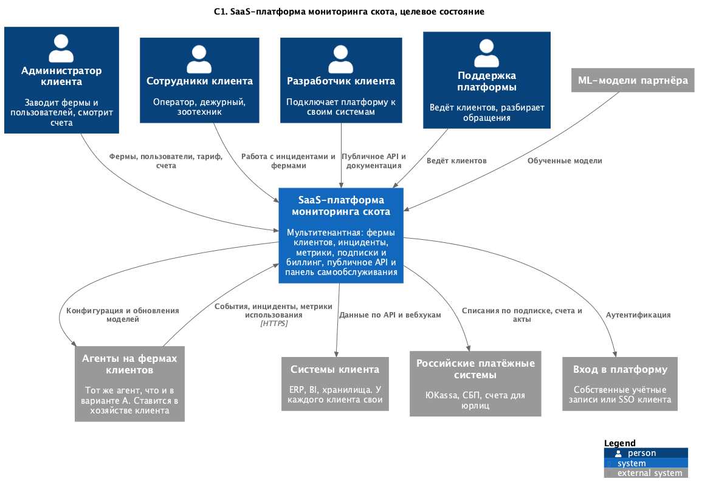
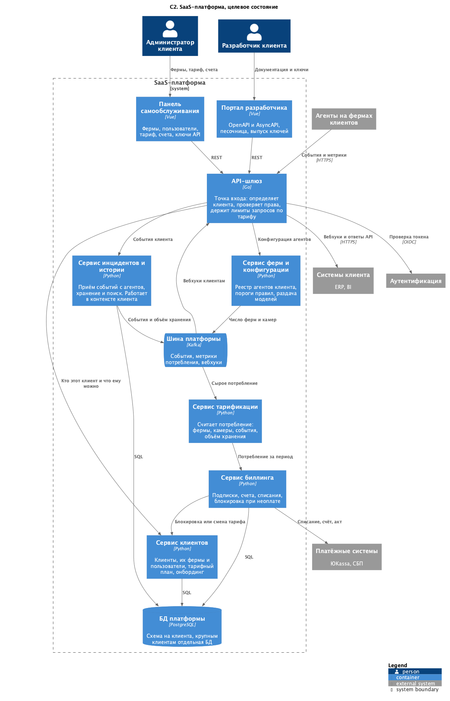
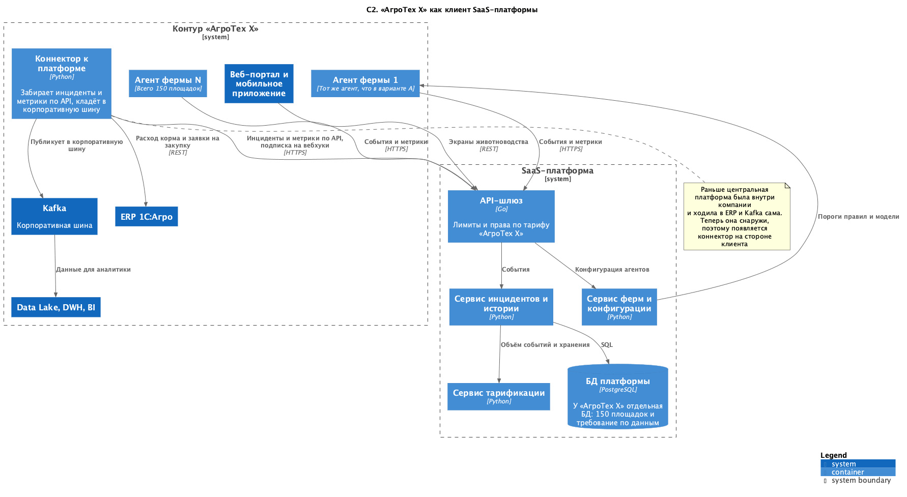

### **Название задачи: Развитие MVP в SaaS-платформу**
### **Автор: Никита Соловьёв**
### **Дата: 21.09.2026**

### **Функциональные требования**

|**№**|**Действующие лица или системы**|**Use Case**|**Описание**|
| :-: | :- | :- | :- |
|1|Клиент, сервис клиентов|Подключение клиента|Клиент регистрируется, получает место для своих данных и тариф, заводит фермы и пользователей сам, без поддержки|
|2|Агент фермы клиента, API-шлюз|Подключение фермы|Агент регистрируется по ключу клиента, дальше работает как в варианте A|
|3|Администратор клиента|Пользователи и роли|Клиент заводит сотрудников и раздаёт роли в пределах своих ферм|
|4|Сервис тарификации|Учёт потребления|Считаем фермы, камеры, объём событий и хранения. Эти же цифры клиент видит у себя|
|5|Сервис биллинга, платёжные системы|Подписка и оплата|Счёт за период, списание через ЮKassa или СБП, для юрлиц счёт и акт. При неоплате ограниченный режим|
|6|Разработчик клиента, портал разработчика|Интеграция|Клиент выпускает ключ, читает OpenAPI и AsyncAPI, пробует запросы в песочнице|
|7|Системы клиента, API-шлюз|Обмен данными|Клиент забирает инциденты и метрики по REST или подписывается на вебхуки|

### **Нефункциональные требования**

|**№**|**Требование**|
| :-: | :- |
|1|Полная изоляция данных между клиентами|
|2|Горизонтальное масштабирование по мере роста числа клиентов|
|3|Метрики использования собираются по каждому клиенту и годятся для биллинга|
|4|Оплата через российские платёжные системы|
|5|Онбординг силами самого клиента|
|6|Требования из ADR-001 никуда не делись: офлайн, 5 секунд, 99,95%|

### **Решение**
Развиваю вариант A из [ADR-003](../Task4/ADR-003-choice.md). Агент на ферме не меняется, меняется центр.

Изоляция данных. Сравнил три варианта: [схема на клиента](C2-isolation-schema.puml),
[БД на клиента](C2-isolation-database.puml), [отдельный набор сервисов на клиента](C2-isolation-instance.puml).

|**Критерий**|**Схема на клиента**|**БД на клиента**|**Контур на клиента**|
| :- | :- | :- | :- |
|Изоляция|логическая, ошибка в коде даёт чужие данные|физическая, разные базы|полная, вплоть до версии кода|
|Стоимость на клиента|низкая|средняя|высокая|
|Онбординг|секунды|минуты|часы, нужен деплой|
|Влияние клиентов друг на друга|общие соединения и диск|базы разные, сервисы общие|полное разделение|
|Миграции|разом на всех|по клиентам, версии расходятся|у каждого своя|
|Бэкап по клиенту|неудобно|штатно|штатно|

Беру смешанный вариант. По умолчанию схема на клиента, крупному по требованию отдельная БД. Схема даёт дешёвый
онбординг. Отдельный набор сервисов каждому не беру, иначе любое обновление умножается на число клиентов.

Полная изоляция в чистом виде только в третьем варианте, схема на клиента держится на правильном tenant_id. Поэтому
проверку клиента выношу в API-шлюз, а tenant_id берём из токена.

Масштабирование. Сервисы центра не хранят состояние у себя, поэтому растут добавлением копий за API-шлюзом. Базу
разгружаем переносом крупных клиентов в отдельную БД. Выполняем НФТ 2.

Биллинг. Учёт и деньги развожу:
- сервис тарификации слушает шину и считает потребление. Фермы и камеры из реестра, объём событий и хранения из сервиса
инцидентов;
- сервис биллинга раз в период превращает потребление в счёт по тарифу, проводит списание через ЮKassa или СБП, юрлицам
выставляет счёт и акт;
- при неоплате клиент уходит в ограниченный режим. Агенты на фермах продолжают работать и копить события, а доступ к
истории и API закрывается. Отключать мониторинг за неуплату нельзя, там живые животные.

Что отдаём клиенту:
- инциденты и их статусы, состояние ферм и оборудования, поголовье, метрики;
- управление фермами и пользователями тоже через API;
- вебхуки вместо опроса;
- не отдаём сырое видео, чужие данные и внутреннюю конфигурацию правил платформы;
- документация и выпуск ключей в портале разработчика, там же песочница с тестовым клиентом.

Целевое состояние: [C1-saas.puml](C1-saas.puml), [C2-saas.puml](C2-saas.puml)

«АгроТех Х» как клиент: [C2-integration-agrotech.puml](C2-integration-agrotech.puml)

Платформа теперь внешняя, поэтому у «АгроТех Х» появляется коннектор. Он забирает инциденты и метрики по API, подписан
на вебхуки и раскладывает данные в корпоративную шину и ERP.

Агенты на 150 площадках не меняются. Из-за объёма компания получает отдельную БД, а не схему.

### **Альтернативы**
Отдельная БД всем клиентам без исключений. Снимает вопрос про логическую изоляцию. Отказался: завести базу и применить
миграции дольше, чем создать схему, а число соединений растёт вместе с числом клиентов.

Отдельный набор сервисов на клиента. Подходит, если появится клиент с требованием своего размещения, как отдельный тариф.

Считать потребление прямо в биллинге, без отдельного сервиса тарификации. Отказался, тогда любое изменение тарифов
заставит трогать код подсчёта событий.

**Недостатки, ограничения, риски**

- Логическая изоляция держится на дисциплине. Один сервис, забывший про tenant_id, отдаёт чужие данные.
- Где граница по объёму, после которой клиента пора переселять в отдельную БД, я не определил.
- Миграция на сотнях схем может упасть на середине, плана отката пока нет.
- Потребление считается по событиям из шины. Потеряется часть сообщений, и счёт будет неверным.
- На наших серверах теперь лежат персональные данные сотрудников чужих организаций. Этим здесь не занимался.
